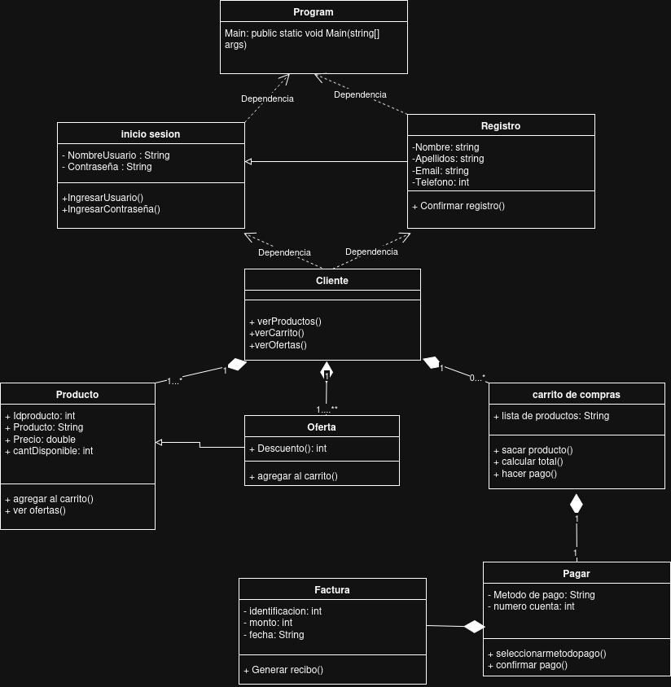
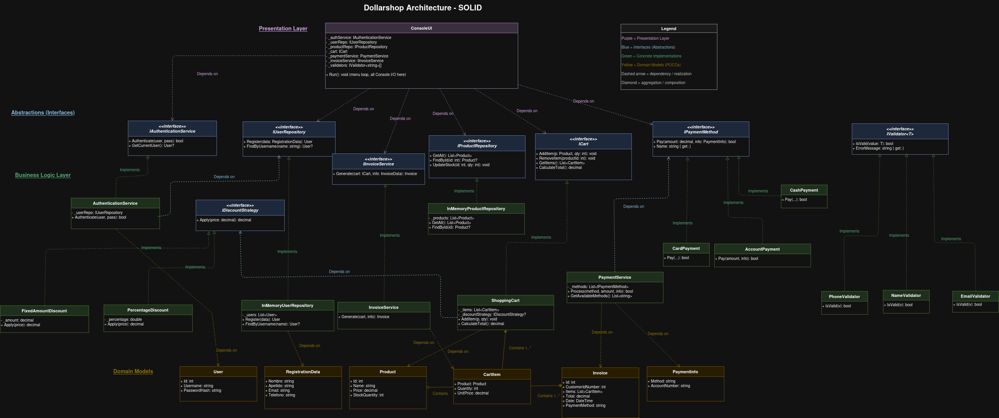

# Dollarshop

A backend-focused e-commerce store mockup built in C#/.NET 10, designed to demonstrate and apply the SOLID principles of object-oriented design.

The project focuses on designing extensible, maintainable, and loosely coupled systems, applying clean architecture concepts and object-oriented best practices in a real-world-inspired domain.

## Architecture

The project is organized into four layers, each with a clear responsibility:

```
Dollarshop/
├── Presentation/       ← Console UI (all user I/O)
├── Abstractions/       ← Interfaces (contracts between layers)
├── Services/           ← Business logic implementations
├── Domain/             ← Pure data models (POCOs)
├── Program.cs          ← Composition root (dependency wiring)
└── docs/               ← UML diagrams and documentation
```

### Presentation Layer

`ConsoleUI` is the single class that handles all `Console.ReadLine`/`Console.WriteLine` calls. It receives every dependency through its constructor as an interface, never as a concrete class. This means the entire UI can be replaced (e.g., with a web API) without touching any business logic.

### Abstractions Layer

Seven focused interfaces define the contracts between layers:

| Interface | Responsibility |
|---|---|
| `IAuthenticationService` | Authenticate users and track the current session |
| `IUserRepository` | Register and look up users |
| `IProductRepository` | Query and update product catalog and stock |
| `ICart` | Add/remove items and calculate totals |
| `IPaymentMethod` | Process a payment (one implementation per method) |
| `IDiscountStrategy` | Apply a discount to a price |
| `IInvoiceService` | Generate invoices from cart contents |
| `IValidator<T>` | Validate a single value and provide an error message |

### Business Logic Layer

Concrete implementations that depend only on abstractions:

- **`AuthenticationService`** - verifies credentials against `IUserRepository`
- **`InMemoryUserRepository`** / **`InMemoryProductRepository`** - in-memory data stores, replaceable with database implementations
- **`ShoppingCart`** - manages cart items with optional `IDiscountStrategy`
- **`PaymentService`** - orchestrates a collection of `IPaymentMethod` strategies
- **`CardPayment`**, **`CashPayment`**, **`AccountPayment`** - individual payment strategies
- **`PercentageDiscount`**, **`FixedAmountDiscount`** - individual discount strategies
- **`InvoiceService`** - generates invoices from cart state
- **`NameValidator`**, **`EmailValidator`**, **`PhoneValidator`** - input validators

### Domain Layer

Pure C# classes with no logic or dependencies: `User`, `Product`, `CartItem`, `Invoice`, `PaymentInfo`, `RegistrationData`.

### Composition Root

`Program.cs` is the only place where concrete classes are instantiated. It wires all dependencies together and passes them into `ConsoleUI`, which runs the application.

## SOLID Principles

### S - Single Responsibility

Each class has exactly one reason to change:

- `ConsoleUI` changes only when the user interface changes.
- `ShoppingCart` changes only when cart logic changes.
- `InvoiceService` changes only when invoice generation changes.
- Domain models change only when the data schema changes.

The legacy code had `Producto` handling data storage, cart operations, and console I/O in a single class with static methods.

### O - Open/Closed

The Strategy pattern allows extension without modification:

- **Payments**: Adding a new payment method (e.g., PayPal) means creating a new class that implements `IPaymentMethod` and registering it in `Program.cs`. No existing payment class is touched.
- **Discounts**: Adding a new discount type (e.g., buy-one-get-one) means creating a new `IDiscountStrategy` implementation. `ShoppingCart` works with any strategy without modification.

The legacy code had hardcoded `if`/`else` chains for payment methods that required modifying `Pagar.cs` for every new option.

### L - Liskov Substitution

Every implementation can be swapped for another that fulfills the same interface contract:

- `InMemoryProductRepository` can be replaced with a `DatabaseProductRepository` and every consumer (`ConsoleUI`, other services) continues to work unchanged.
- `ShoppingCart` can be replaced with any `ICart` implementation (e.g., one backed by Redis for session persistence).

The legacy code used `static` methods and global state, making substitution impossible.

### I - Interface Segregation

Interfaces are small and focused. No client is forced to depend on methods it doesn't use:

- `IValidator<T>` has only 2 members (`IsValid`, `ErrorMessage`).
- `IDiscountStrategy` has only 1 member (`Apply`).
- `IPaymentMethod` has only 2 members (`Pay`, `Name`).

The legacy code had `Producto` exposing product data, a static list, cart operations, and console I/O all as one monolithic surface.

### D - Dependency Inversion

High-level modules depend on abstractions, not concretions:

- `ConsoleUI` depends on `IAuthenticationService`, `IProductRepository`, `ICart`, etc., never on `AuthenticationService` or `ShoppingCart` directly.
- `AuthenticationService` depends on `IUserRepository`, not on `InMemoryUserRepository`.
- `ShoppingCart` depends on `IDiscountStrategy`, not on `PercentageDiscount`.

All concrete implementations are instantiated exclusively in `Program.cs` (the composition root) and injected via constructors.

The legacy code had direct class-to-class coupling: `Producto` called `Carrito.AgregarProductoAlCarrito()`, `Factura` called `Carrito.CalcularTotal()`, `Ofertas` accessed `Producto.ListaProductos` directly.

## Before & After: Applying SOLID Principles

### Before — Legacy Architecture

The original codebase was a monolithic console application where every class depended directly on every other class through static methods and global state. There were no interfaces, no separation of concerns, and no way to extend or test the system in isolation.



**Key problems visible in the diagram:**
- `Program` depends directly on every concrete class.
- `Producto` handles data storage, cart operations, and console I/O.
- `Carrito de compras` is tightly coupled to `Pagar` and `Factura` through composition arrows with no abstraction layer.
- `Oferta` mutates `Producto` prices directly.
- All relationships are concrete class-to-class dependencies — nothing is substitutable.

### After — SOLID-Compliant Architecture

The refactored architecture separates the system into four distinct layers. Every dependency flows downward through interfaces, making each component independently replaceable and testable.



**Key improvements visible in the diagram:**
- **Presentation Layer** (purple): `ConsoleUI` depends only on interfaces, never on concrete services.
- **Abstractions Layer** (blue): 8 focused interfaces define the contracts between layers.
- **Business Logic Layer** (green): Concrete implementations like `ShoppingCart`, `CardPayment`, and `PercentageDiscount` implement their respective interfaces and can be extended via the Strategy pattern (OCP).
- **Domain Models** (yellow): Pure data classes with no dependencies on any other layer.
- All arrows point toward abstractions, not concretions (DIP).

The detailed Mermaid class diagram is also available in [`docs/architecture.md`](docs/architecture.md) and renders directly on GitHub.

## Running the Project

```bash
dotnet build
dotnet run
```

Default credentials: `samuel` / `123`

## Tech Stack

- C# / .NET 10
- Console application (no external dependencies)
