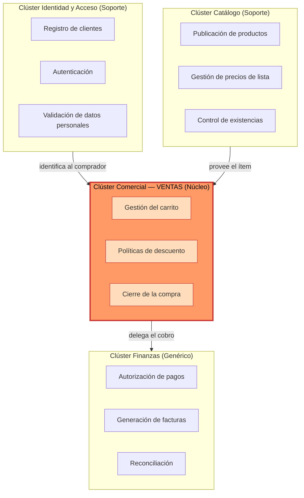
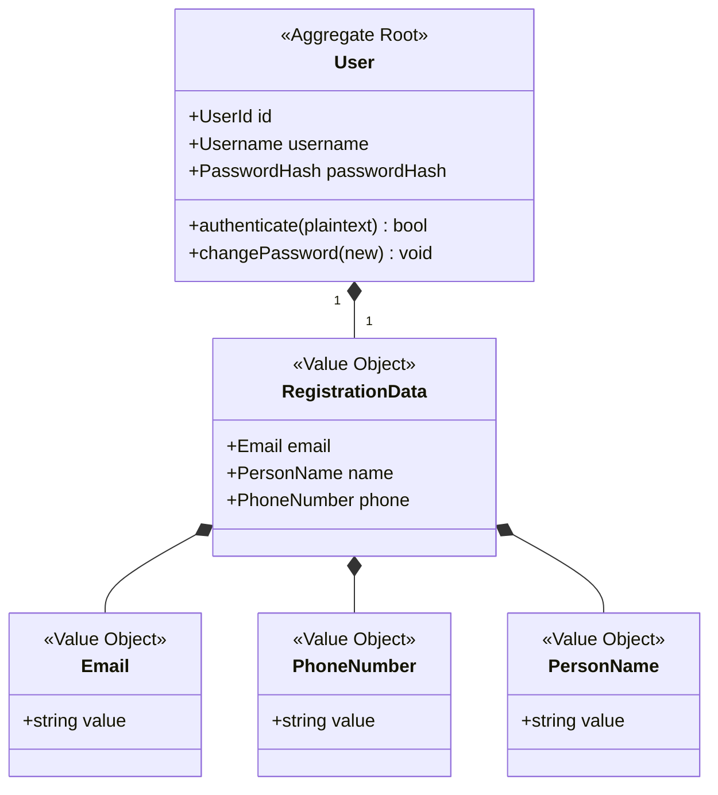
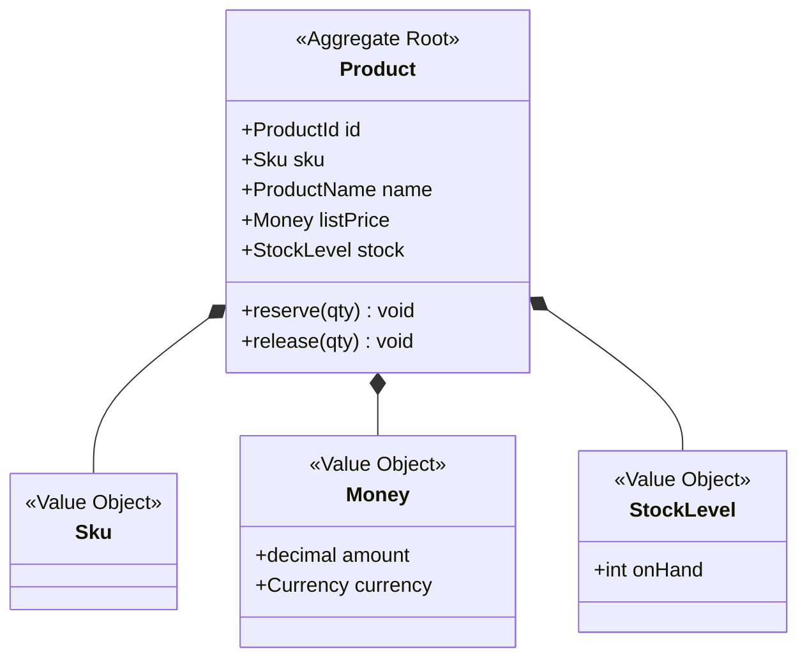
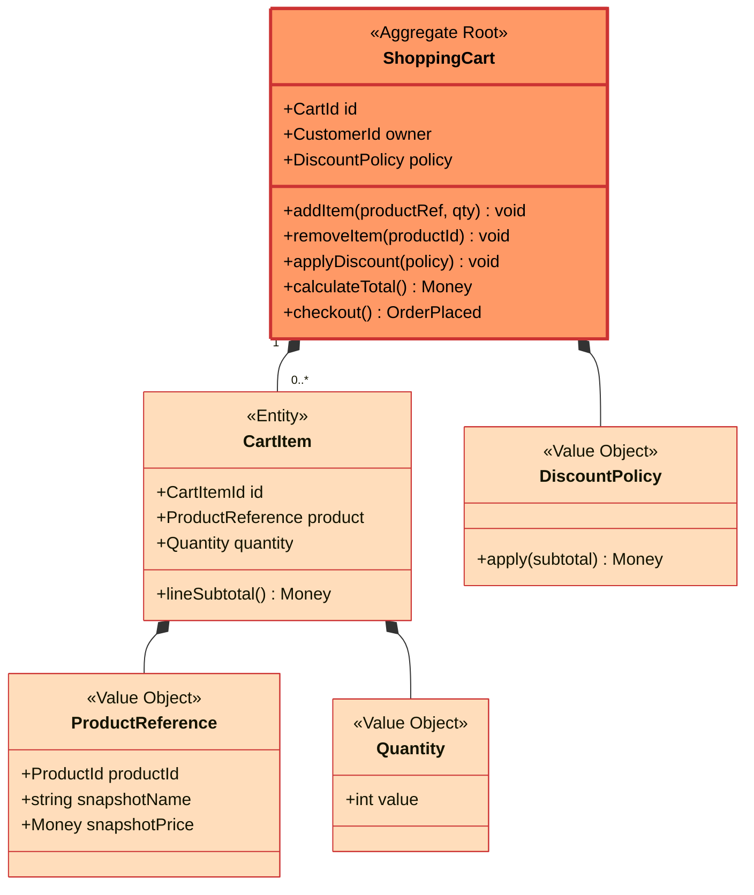
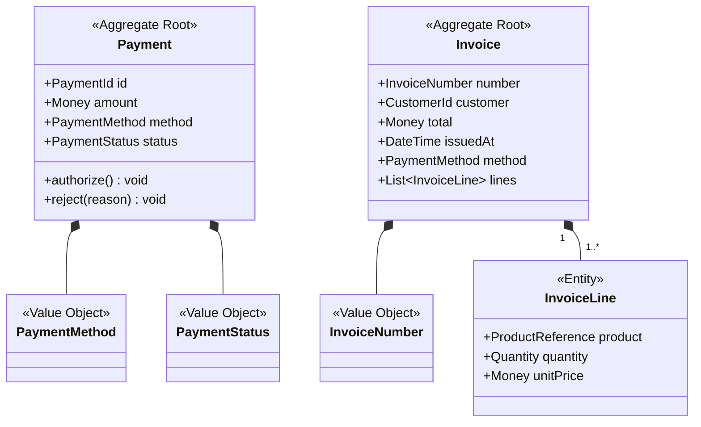
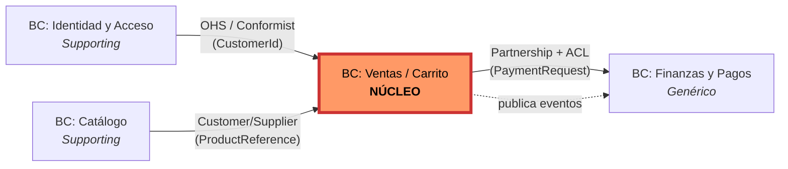
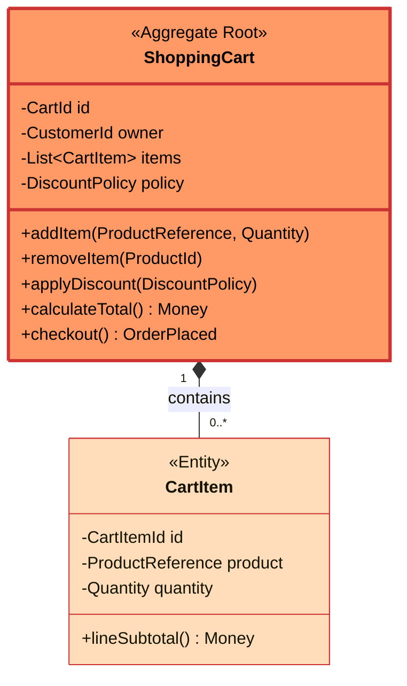
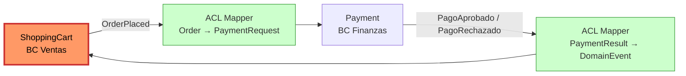

# Entrega 3 — Diseño Domain-Driven Design (DDD) de Dollarshop

**Asignatura:** Arquitecturas de Software
**Programa:** Ingeniería de Sistemas — Universidad Pontificia Bolivariana, Medellín
**Autores:** Roy Sandoval · Juan David Londoño
**Año:** 2026

---

## Tabla de contenidos

1. Introducción y contexto del negocio
2. Estructura organizacional agrupada por afinidad
3. Dominios, entidades y agregados
4. Bounded Contexts y su flujo
5. Lenguaje Ubicuo — glosario
6. Dominio seleccionado: Ventas / Carrito — detalle táctico
7. Protección del modelo núcleo y proyección al ensamblado
8. Trazabilidad: rúbrica → sección

---

## 1. Introducción y contexto del negocio

Dollarshop es una tienda en línea cuyo modelo de negocio se sostiene sobre cuatro funciones críticas: **registrar clientes**, **publicar un catálogo de productos**, **convertir la intención de compra en una venta cerrada** y **cobrar y formalizar legalmente esa venta**.El modelo se construye **desde el negocio hacia el código**, no a la inversa.

El **dominio seleccionado como núcleo** es **Ventas / Carrito**. Es el único dominio que materializa la propuesta de valor diferencial de Dollarshop —la negociación comercial mediante políticas de descuento componibles— y, por tanto, el que debe quedar protegido de toda corrupción externa. En todos los diagramas se resalta con un color distinto (naranja) para que el lector lo identifique de inmediato.

---

## 2. Estructura organizacional agrupada por afinidad

### 2.1 Criterio de afinidad

La afinidad se mide aquí por **cohesión funcional del negocio**, no por similitud técnica. Dos procesos pertenecen al mismo clúster si tienden a cambiar juntos cuando cambia una regla del negocio, si comparten vocabulario con los mismos stakeholders y si una falla en uno típicamente compromete al otro. Bajo este criterio surgen cuatro clústeres operativos:

- **Clúster de Identidad y Acceso:** todo lo relativo a *quién opera* en la plataforma —registro, autenticación, validación de datos del cliente—.
- **Clúster de Catálogo:** todo lo relativo a *qué se ofrece* —productos, precios de lista, existencias—.
- **Clúster Comercial (Ventas):** todo lo relativo a *cómo se negocia la compra* —carrito, ítems, políticas de descuento, cierre de la transacción—. **Este es el núcleo.**
- **Clúster de Finanzas:** todo lo relativo a *cómo se cobra y se formaliza* —métodos de pago, autorización, factura—.

### 2.2 Diagrama de afinidad organizacional



### 2.3 Justificación de los cortes

- **Alta cohesión interna:** las validaciones de correo, nombre y teléfono viven en Identidad —no en Catálogo, como sugería el borrador— porque validan **datos del cliente**, y donde vive el dato es donde vive su regla.
- **Bajo acoplamiento entre clústeres:** Finanzas no necesita conocer al cliente para cobrar (solo el monto y el medio de pago), por lo que no se traza una dependencia directa Identidad → Finanzas.
- **Criterio de cambio común:** un cambio en una política de descuento solo debe tocar el clúster de Ventas; un cambio en la pasarela de pago solo debe tocar Finanzas. Si un cambio cruza clústeres, se ha encontrado una mala costura.

---

## 3. Dominios, entidades y agregados

A partir de los clústeres se derivan cuatro dominios. Para cada uno se declara su **clasificación estratégica** (Core, Supporting, Generic) —porque la inversión arquitectónica debe ser proporcional al valor diferencial—.

### 3.1 Dominio de Identidad y Acceso (Supporting)

**Responsabilidad:** garantizar que quien interactúa con Dollarshop esté registrado y autenticado, y que sus datos de contacto sean válidos.

**Por qué Supporting:** no es diferenciador (cualquier e-commerce hace lo mismo), pero sí es propio (no se delega a un proveedor externo en esta fase).



**Por qué `User` es la raíz:** `RegistrationData` no tiene ciclo de vida independiente —no existe un correo sin un usuario que lo posea—, y los validadores (`EmailValidator`, `NameValidator`, `PhoneValidator`) son **especificaciones** que viven dentro de los constructores de los VOs, no entidades por sí mismas.

### 3.2 Dominio de Catálogo (Supporting)

**Responsabilidad:** mantener la oferta visible —qué se vende, a qué precio de lista, cuánto hay en existencia—.

**Por qué Supporting:** la curaduría del catálogo es importante pero no es donde Dollarshop compite.



**Refinamiento sobre el código actual (`Domain/Product.cs`):** hoy `Price` es un `decimal` plano y `StockQuantity` un `int`. El diseño DDD los promueve a VOs (`Money`, `StockLevel`) para que las invariantes —no se vende en negativo, no hay reservas mayores al stock— vivan en el tipo y no se repliquen en cada uso.

### 3.3 Dominio de Ventas / Carrito (Núcleo) — resaltado

**Responsabilidad:** transformar la intención de compra del cliente en una venta lista para ser cobrada, aplicando las políticas comerciales que diferencian a Dollarshop.

**Por qué Core:** las políticas de descuento componibles, la persistencia del carrito y la lógica de checkout son los activos competitivos. Aquí se invierte el mayor esfuerzo de modelado.



**Por qué `ShoppingCart` es la raíz y `CartItem` no es accesible directamente:** todas las invariantes del carrito (unicidad de producto, total no negativo, descuento ≤ subtotal) son propiedades **del conjunto**, no de un ítem aislado. Permitir el acceso directo a `CartItem` rompería esa garantía. El código actual (`Services/ShoppingCart.cs`) ya respeta esta frontera y se mantiene.

### 3.4 Dominio de Finanzas y Pagos (Genérico)

**Responsabilidad:** autorizar la transacción monetaria y emitir el soporte legal de la operación (factura).

**Por qué Genérico:** cobrar y facturar son problemas resueltos por la industria; lo deseable a futuro es subcontratar la mayor parte (pasarela de pagos, software de facturación electrónica) y mantener aquí solo la capa antiCorrupción.



**Nota arquitectónica:** `Payment` e `Invoice` son agregados independientes —no uno contenido en el otro—. Un pago puede existir sin factura (autorizado pero pendiente de facturar) y, en escenarios de devolución, una factura puede tener varios eventos de pago asociados.

---

## 4. Bounded Contexts y su flujo

### 4.1 Mapa de contextos (Context Map)

Cada dominio se realiza como un Bounded Context con su propio modelo, su propio lenguaje y su propio repositorio de código. Las relaciones se nombran con los patrones canónicos de Context Mapping de Evans.



| Relación | Patrón DDD | Justificación |
|---|---|---|
| IAM → Ventas | **Open Host Service / Conformist** | Identidad expone una API estable (login, perfil); Ventas se adapta a ella sin tratar de reescribirla. |
| Catálogo → Ventas | **Customer/Supplier** | Ventas es cliente formal del catálogo: negocia el contrato (qué campos necesita en `ProductReference`) y Catálogo se compromete a sostenerlos. |
| Ventas → Finanzas | **Partnership + Anti-Corruption Layer** | Las dos equipos coordinan el cierre de la venta, pero el modelo de Finanzas (que tiende a parecerse al de la pasarela externa) no se permite entrar al modelo de Ventas; un *mapper* traduce `Cart → PaymentRequest`. |

### 4.2 Servicios expuestos y APIs consumidas por cada BC

| BC | Servicios de dominio expuestos | APIs que consume |
|---|---|---|
| Identidad y Acceso | `registerCustomer`, `authenticate`, `getCustomerProfile` | — |
| Catálogo | `listProducts`, `getProduct`, `reserveStock`, `releaseStock` | — |
| **Ventas (núcleo)** | `createCart`, `addItem`, `removeItem`, `applyDiscount`, `calculateTotal`, `checkout` | Identidad: `getCustomerProfile` · Catálogo: `getProduct`, `reserveStock` · Finanzas: `requestPayment` |
| Finanzas y Pagos | `requestPayment`, `issueInvoice`, `getInvoice` | Pasarela externa (vía ACL) |

### 4.3 Por qué los cortes están donde están

Cada frontera obedece a una pregunta de negocio:

- **¿Quién posee el dato del precio en el momento del checkout?** Catálogo posee el precio de lista, pero el carrito **fija el precio en el momento de añadir el ítem** (vía `ProductReference` con `snapshotPrice`). Esto traza una frontera dura: Ventas no consulta a Catálogo a la hora de calcular el total.
- **¿Quién decide si una compra está aprobada?** Finanzas, exclusivamente. Ventas emite el evento `CheckoutIniciado` y espera; nunca interpreta códigos de la pasarela.
- **¿Quién valida un correo?** Identidad. Catálogo no debe contener un `EmailValidator`, aunque el borrador inicial lo sugería. Este documento corrige esa ubicación.

Estos cortes responden directamente a la observación del docente en la entrega anterior: *"el análisis estructural está relacionado en las funciones del negocio: payments, discounts, validations"*. Aquí cada frontera se justifica por una función del negocio, no por un patrón de diseño.

---

## 5. Lenguaje Ubicuo — glosario

| Término del negocio | Término técnico-dominio | Definición operativa |
|---|---|---|
| Cliente | `Customer` / `User` (BC Identidad) | Persona registrada con credenciales y datos de contacto. |
| Carrito | `ShoppingCart` (raíz de agregado, BC Ventas) | Conjunto mutable de ítems que un cliente intenta comprar en una sesión. |
| Ítem del carrito | `CartItem` (entidad, BC Ventas) | Una línea del carrito: producto + cantidad + precio congelado. |
| Producto | `Product` (raíz de agregado, BC Catálogo) | Artículo publicado para la venta. |
| Catálogo | Bounded Context Catálogo | Conjunto de productos disponibles en un momento dado. |
| Existencias | `StockLevel` (VO, BC Catálogo) | Cantidad disponible para reservar. |
| Descuento | `Discount` (concepto) | Reducción aplicada al subtotal del carrito. |
| Política de descuento | `DiscountPolicy` (VO, BC Ventas) | Regla concreta que define cómo se calcula el descuento (porcentual, monto fijo, compuesta). |
| Subtotal | `LineSubtotal` / `Money` (VO) | Suma de los ítems antes de descuentos. |
| Total | `Money` (VO) | Subtotal menos descuentos. |
| Cierre / Checkout | `checkout` (operación del agregado `ShoppingCart`) | Transición que convierte el carrito en una orden lista para cobro. |
| Pago | `Payment` (raíz de agregado, BC Finanzas) | Transacción monetaria solicitada para cubrir un total. |
| Método de pago | `PaymentMethod` (VO, BC Finanzas) | Mecanismo (efectivo, tarjeta, cuenta) usado para el pago. |
| Pasarela de pago | Servicio externo accedido vía ACL | Sistema de un tercero que autoriza la transacción. |
| Factura | `Invoice` (raíz de agregado, BC Finanzas) | Soporte legal emitido tras un pago aprobado. |
| Cuenta | `Username` + `PasswordHash` (BC Identidad) | Credenciales del cliente. |
| Sesión | concepto del BC Identidad | Período en el que un cliente está autenticado. |

El glosario es vinculante: cualquier identificador en código que se desvíe de esta tabla es un olor de diseño.

---

## 6. Dominio seleccionado: Ventas / Carrito — detalle táctico

A partir de aquí todo lo descrito pertenece al **BC Ventas**, el núcleo. El énfasis no es exhaustividad de clases sino *justificación de cada decisión táctica*.

### 6.1 Agregado, raíz e invariantes

`ShoppingCart` es la raíz del agregado. Contiene una colección de `CartItem`, una `DiscountPolicy` opcional y la referencia al `CustomerId` propietario.

**Invariantes que la raíz protege:**

1. **Unicidad por producto:** no pueden coexistir dos `CartItem` con el mismo `ProductId`; la operación `addItem` consolida cantidades.
2. **Cantidades positivas:** `Quantity ≥ 1` (validado en el VO `Quantity`).
3. **Total no negativo:** `subtotal - descuento ≥ 0`.
4. **Descuento ≤ subtotal:** ninguna política de descuento puede generar un total negativo; el agregado rechaza la aplicación si la violación es detectada.
5. **Inmutabilidad del precio una vez añadido:** un cambio en el precio de lista del producto no muta los ítems ya en el carrito.



`CartItem` es **Entidad y no VO** porque tiene identidad propia dentro del agregado (puede modificarse su cantidad sin reemplazar el ítem completo). Sin embargo, esa identidad solo es relevante **dentro del carrito**; fuera del agregado, un `CartItem` no tiene sentido.

### 6.2 Objetos de Valor del dominio Ventas (Criterio rúbrica #5)

Los Value Objects encapsulan reglas de formato y comparación por valor. Son inmutables: una vez construidos, no se modifican; cualquier "cambio" produce una nueva instancia.

| VO | Atributos | Invariantes en constructor | Por qué VO y no Entidad |
|---|---|---|---|
| `Money` | `decimal amount`, `Currency currency` | `amount ≥ 0`; `currency` no nulo | Dos montos iguales son intercambiables; no tienen ciclo de vida. |
| `Quantity` | `int value` | `value ≥ 1` (no se añaden cero ni negativos) | Una cantidad de 3 es indistinguible de otra cantidad de 3. |
| `ProductReference` | `ProductId productId`, `string snapshotName`, `Money snapshotPrice` | `productId` no nulo; `snapshotPrice ≥ 0` | Es un **snapshot** del producto en el instante de la adición; si cambia el catálogo, este objeto **no cambia**. Es la pieza clave de protección anti-corrupción del núcleo. |
| `DiscountPolicy` | depende de la variante: `PercentageDiscount(percent)`, `FixedAmountDiscount(amount)`, `CompositeDiscount(policies)` | porcentaje ∈ [0, 100]; monto ≥ 0 | La política se define por su valor, no por identidad: dos descuentos del 10 % son el mismo descuento. |
| `LineSubtotal` | `Money value` (derivado) | derivado de `quantity × snapshotPrice` | No es persistido, es una proyección. |
| `CartId`, `CartItemId`, `ProductId`, `CustomerId` | `Guid value` | no vacío | Identificadores fuertemente tipados para evitar mezclas (`primitive obsession`). |

**Justificación arquitectónica clave — `ProductReference`:** se eligió **deliberadamente** que el carrito no guarde una referencia viva al `Product` del Catálogo, sino un *snapshot* inmutable. Esto:

- Impide que un cambio de precio en Catálogo altere carritos en vuelo.
- Rompe la dependencia temporal entre los dos BCs (el carrito puede mostrarse aun si el Catálogo está caído).
- Funciona como una **Anti-Corruption Layer implícita**: el modelo de Catálogo no penetra el modelo de Ventas.

### 6.3 Triggers y eventos de dominio (Criterio rúbrica #6)

Los Triggers son acciones (verbo en presente / imperativo); los Eventos son hechos consumados (verbo en pasado). Los eventos los emite **el agregado**, no los servicios, y son inmutables.

| # | Trigger | Comando | Invariante verificada | Evento emitido (pasado) |
|---|---|---|---|---|
| 1 | Cliente añade producto al carrito | `AddItemCommand(cartId, productRef, qty)` | unicidad por producto; cantidad ≥ 1 | `CarritoItemAgregado` |
| 2 | Cliente elimina producto del carrito | `RemoveItemCommand(cartId, productId)` | existencia del ítem | `CarritoItemRemovido` |
| 3 | Sistema aplica política de descuento | `ApplyDiscountCommand(cartId, policy)` | descuento ≤ subtotal | `DescuentoAplicado` |
| 4 | Cliente confirma checkout | `CheckoutCommand(cartId, paymentInfo)` | total > 0; carrito no vacío | `CheckoutIniciado` (cruza al BC Finanzas vía ACL) |
| 5 | Finanzas confirma cobro | (evento entrante: `PagoAprobado`) | — | `VentaCerrada` |
| 6 | Finanzas rechaza cobro | (evento entrante: `PagoRechazado`) | — | `CheckoutRevertido` |
| 7 | Sesión expira sin checkout | `ExpireCartCommand(cartId)` | TTL excedido | `CarritoAbandonado` |

**Reglas sobre eventos:**

- Nombrados en pasado y en el lenguaje del negocio (`CarritoItemAgregado`, no `ItemAddedToCart`).
- Inmutables: una vez emitidos, no se editan.
- Llevan únicamente el dato necesario para que otros BCs reaccionen (no exponen toda la raíz).
- Publicados por la raíz del agregado al finalizar la operación que los provoca; nunca por un servicio externo.

### 6.4 Servicios del dominio Ventas (Criterio rúbrica #7)

Un **servicio de dominio** existe únicamente cuando una operación de negocio **no pertenece naturalmente a una entidad ni a un VO**. Es importante distinguirlo del **servicio de aplicación**, que orquesta el caso de uso pero no contiene lógica de negocio.

| Servicio | Tipo | Responsabilidad | Por qué no vive en el agregado |
|---|---|---|---|
| `CartPricingService` | Servicio de dominio | Compone múltiples políticas de descuento (`CompositeDiscount`) cuando provienen de fuentes heterogéneas (cliente VIP + cupón promocional). | Conoce reglas que cruzan políticas; no es responsabilidad de una sola `DiscountPolicy`. |
| `CartTransitionService` | Servicio de dominio | Materializa la transición `ShoppingCart → OrderPlaced` (inmutable) antes de entregarla al BC Finanzas. | La transición produce un objeto nuevo (`OrderPlaced`) que no pertenece a `ShoppingCart`. |
| `CheckoutApplicationService` | Servicio de **aplicación** (no de dominio) | Orquesta: invoca `CartTransitionService`, traduce vía ACL a `PaymentRequest`, despacha al BC Finanzas, espera el evento, marca el carrito. | Coordina pero no decide. Aquí se manejan transacciones y rollbacks. |

**Reasignación importante desde el código actual:** la clase `Services/CheckoutService.cs` mezcla actualmente orquestación con conocimiento de pagos. En el rediseño se descompone:

- La parte de transición `Cart → Order` baja al **dominio** (`CartTransitionService`).
- La parte de coordinación con `IPaymentService` y `IInvoiceService` sube a **aplicación** (`CheckoutApplicationService`).

Esto cierra exactamente el hueco que el profesor señaló en la entrega anterior: *"bajo `domain/` está todo el negocio y se mezclan todas las responsabilidades"*.

---

## 7. Protección del modelo núcleo y proyección al ensamblado

### 7.1 Anti-Corruption Layer hacia Finanzas



La ACL es un mapper bidireccional. Su existencia garantiza que **ningún tipo del BC Finanzas** (que probablemente se contagia del SDK de la pasarela) cruce hacia el BC Ventas, y viceversa.

### 7.2 Snapshots de Catálogo dentro del Carrito

Ya descrito en §6.2. Es la segunda barrera anti-corrupción del núcleo: el carrito no depende del Catálogo en runtime después de la primera adición.

### 7.3 Proyección al ensamblado (estructura de carpetas)

Respuesta directa al feedback "*bajo `domain/` está todo el negocio mezclado*". La estructura objetivo organiza el código **por Bounded Context** y, dentro de cada uno, por capa:

```
src/
├── Identity/
│   ├── Domain/        (User, RegistrationData, Email, ...)
│   ├── Application/   (RegisterCustomerUseCase, AuthenticateUseCase)
│   └── Infrastructure/(InMemoryUserRepository, ...)
├── Catalog/
│   ├── Domain/        (Product, Sku, Money, StockLevel)
│   ├── Application/   (ListProductsUseCase, ReserveStockUseCase)
│   └── Infrastructure/(InMemoryProductRepository)
├── Sales/              ◄── NÚCLEO
│   ├── Domain/        (ShoppingCart, CartItem, DiscountPolicy, ProductReference, eventos)
│   ├── Application/   (CheckoutApplicationService, AddItemUseCase, ...)
│   └── Infrastructure/(repositorios, ACL → Finance)
└── Finance/
    ├── Domain/        (Payment, Invoice, InvoiceLine, PaymentMethod)
    ├── Application/   (RequestPaymentUseCase, IssueInvoiceUseCase)
    └── Infrastructure/(CashPayment, CardPayment, AccountPayment, InvoiceBuilder)
```

Cada BC es **autónomo**: tiene su propio dominio, su propia aplicación y su propia infraestructura. Esta proyección hace ejecutable el diseño y deja a la entrega de implementación con un mapa claro de dónde va cada archivo del repo actual.

---

## 8. Trazabilidad: rúbrica → sección

| # | Criterio de la rúbrica (Documento Diseño DDD, 15 pts) | Sección que lo cubre |
|---|---|---|
| 1 | Gráfica con flujo de la estructura organizacional agrupados por afinidad, que permita ver los posibles dominios del problema | §2 (especialmente §2.2 y §2.3) |
| 2 | Gráficos con Dominios y dentro de ellos entidades y agregados | §3 (diagramas en §3.1, §3.2, §3.3, §3.4) |
| 3 | Gráfico Bounded Context donde se vea el flujo de entidades, agregados, servicios que se ofrecen y APIs que consume | §4 (diagrama §4.1, tabla §4.2, justificación §4.3) |
| 4 | Lenguaje Ubicuo presentado en un glosario de términos de negocio | §5 |
| 5 | Objetos de Valor del dominio seleccionado | §6.2 |
| 6 | Triggers y Eventos del dominio seleccionado | §6.3 |
| 7 | Definir Servicios del dominio seleccionado | §6.4 |
| (Nota de la rúbrica) "Pintar el dominio seleccionado de otro color en los gráficos" | El BC Ventas / Carrito está resaltado en naranja en **todos** los diagramas (§2.2, §3.3, §4.1, §6.1, §7.1) |
