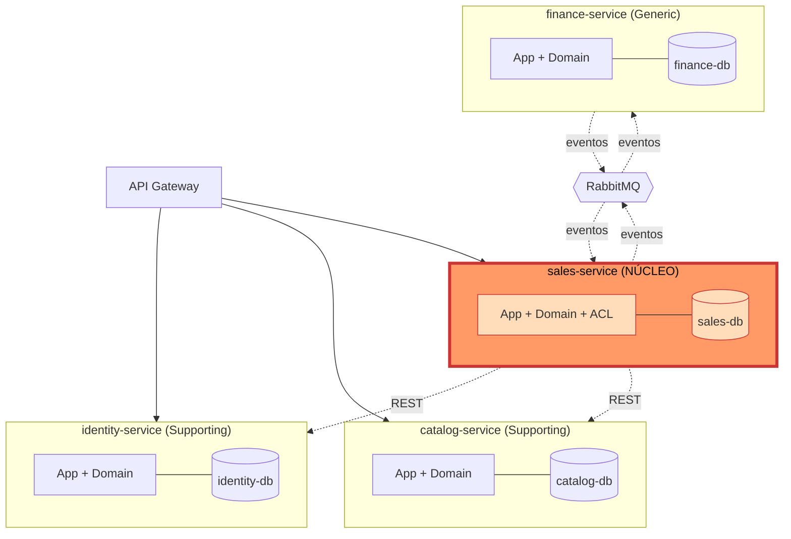
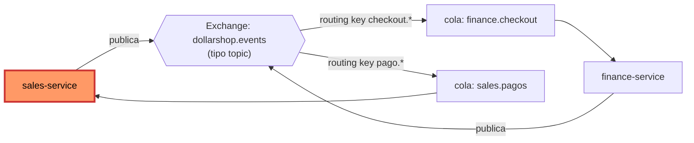
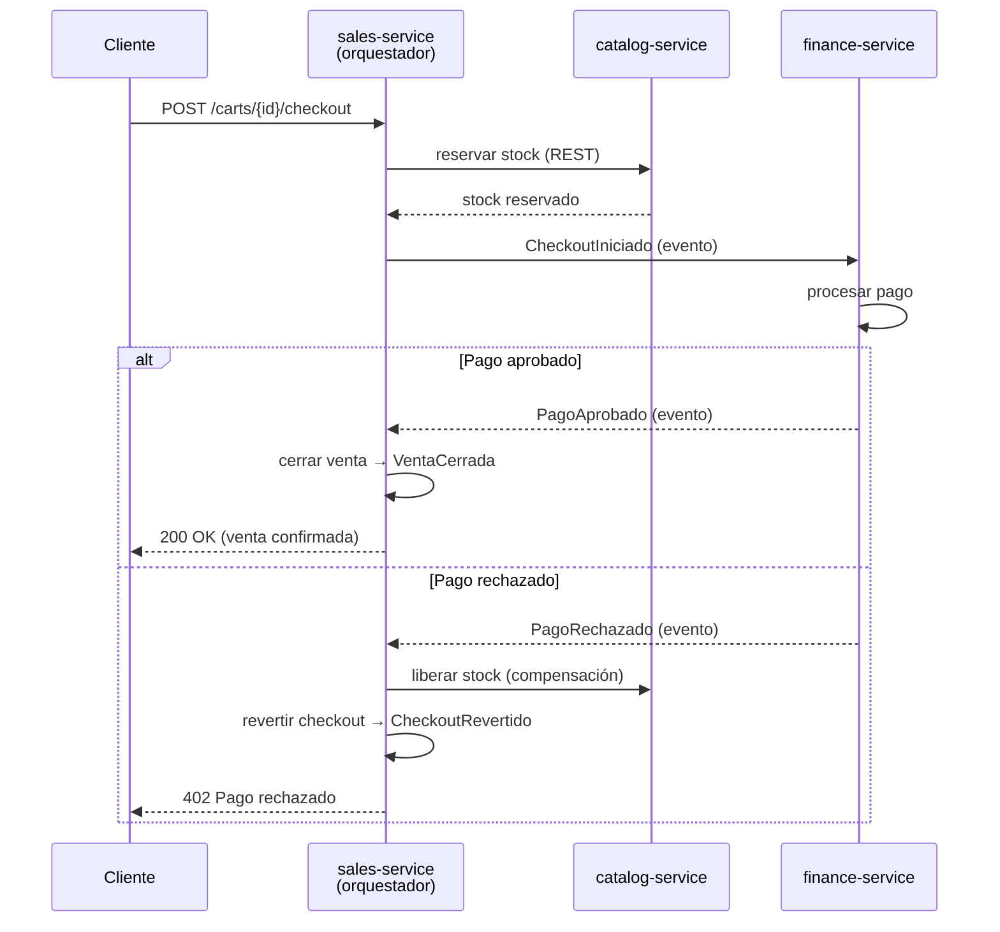
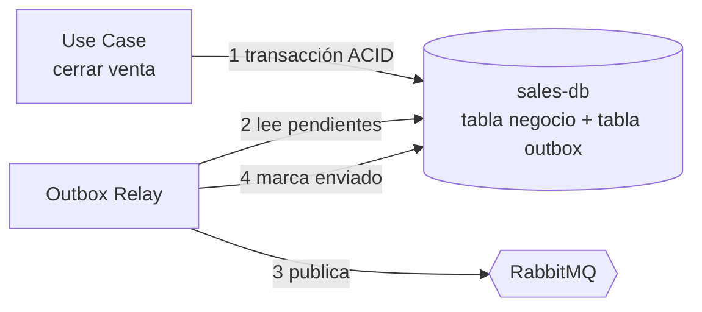
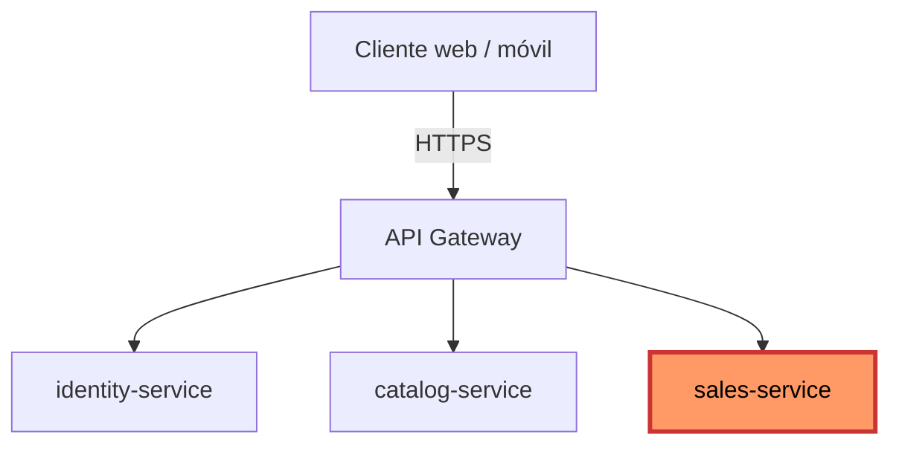
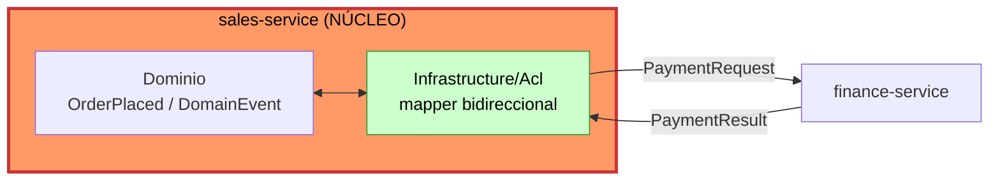
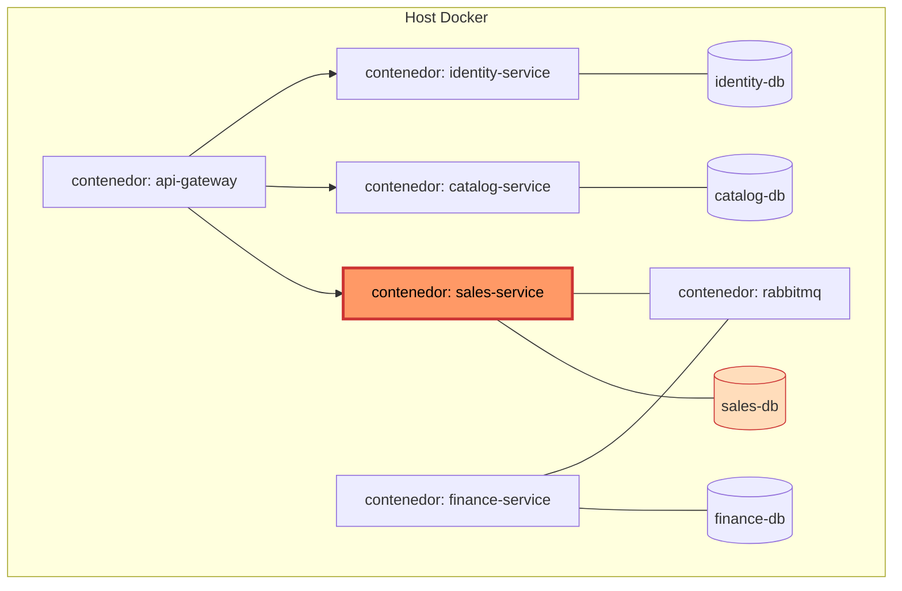

# Arquitectura de Microservicios — Dollarshop

**Asignatura:** Arquitecturas de Software
**Programa:** Ingeniería de Sistemas — Universidad Pontificia Bolivariana, Medellín
**Autores:** Roy Sandoval · Juan David Londoño
**Año:** 2026

> **Fuente de verdad:** este documento implementa físicamente el modelo lógico definido en `docs/DDD/Entrega 3 - DDD.md`. No se introducen dominios nuevos ni se mueven fronteras: los 4 Bounded Contexts del DDD se mapean 1-a-1 a microservicios. Los patrones aquí seleccionados fueron validados con la skill `microservices-patterns`.

---

## Tabla de contenidos

1. Introducción y principios rectores
2. Descomposición de servicios y mapeo
3. Comunicación entre servicios
4. API Gateway y gestión de fronteras
5. Capa Anti-Corrupción (ACL) Ventas ↔ Finanzas
6. Topologías internas de cada microservicio
7. Vista de despliegue, resiliencia y atributos de calidad

---

## 1. Introducción y principios rectores

### 1.1 Por qué microservicios para Dollarshop

El modelo DDD identificó cuatro Bounded Contexts con ciclos de cambio, vocabularios y perfiles de carga distintos. Mantenerlos en un único despliegue monolítico obliga a que todos escalen, se desplieguen y fallen juntos. La arquitectura de microservicios rompe ese acoplamiento y aporta tres beneficios concretos para el negocio:

- **Autonomía de despliegue:** una corrección en una política de descuento (núcleo Ventas) se libera sin redeplegar Identidad ni Finanzas.
- **Aislamiento de fallos:** si la pasarela de pago externa degrada, el cliente todavía navega el catálogo y arma su carrito.
- **Escalado independiente:** el `sales-service` —que absorbe los picos de checkout y cálculo de descuentos— escala horizontalmente sin arrastrar a servicios de baja carga.

### 1.2 El trade-off, declarado honestamente

Los microservicios no son gratis. Se acepta deliberadamente un costo a cambio de la autonomía:

| Se gana | Se paga |
| :--- | :--- |
| Autonomía de despliegue y escalado | Complejidad operativa: red, despliegue, observabilidad |
| Aislamiento de fallos | Latencia de red en cada llamada entre servicios |
| Libertad tecnológica por servicio | Pérdida de transacciones ACID globales → consistencia eventual |

La decisión se justifica por el modelo de negocio: Dollarshop tiene **picos marcados de tráfico en checkout y promociones**, concentrados en un solo contexto (Ventas). Un monolito obligaría a sobre-aprovisionar todo el sistema para soportar un pico localizado. El costo operativo de los microservicios se paga, así, con ahorro de infraestructura y resiliencia del resto del sistema.

### 1.3 Principio rector

**Un Bounded Context = un microservicio.** Sin excepciones. Esta regla evita el error más común de la descomposición —partir por capas técnicas o por entidades— y garantiza que cada servicio tenga una frontera de negocio real, alineada con el Context Map del DDD.

---

## 2. Descomposición de servicios y mapeo *(Pilar 1)*

### 2.1 Mapeo Bounded Context → microservicio

La descomposición se hace **por subdominio DDD**: cada BC del documento DDD se convierte en un servicio con su propia base de datos, su propio repositorio de código y su propio ciclo de despliegue.

| Bounded Context (DDD) | Microservicio | Responsabilidad de negocio | Clasificación |
| :--- | :--- | :--- | :--- |
| Identidad y Acceso | `identity-service` | Registrar y autenticar clientes; validar sus datos de contacto | Supporting |
| Catálogo | `catalog-service` | Publicar productos, precios de lista y existencias | Supporting |
| **Ventas / Carrito** | **`sales-service`** | **Gestionar el carrito, aplicar descuentos y orquestar el checkout** | **Core** |
| Finanzas y Pagos | `finance-service` | Autorizar pagos y emitir facturas | Generic |

La clasificación Core/Supporting/Generic se hereda íntegra del DDD y gobierna la inversión arquitectónica: `sales-service` recibe el mayor esfuerzo de diseño (ACL, Saga, resiliencia); `finance-service`, al ser genérico, se diseña para ser eventualmente subcontratado.

### 2.2 Topología de servicios y datos



### 2.3 Patrón Database per Service

Cada microservicio **posee en exclusiva su base de datos**. Ningún servicio lee ni escribe la base de datos de otro; el único acceso a los datos ajenos es a través de la API pública o de los eventos del servicio dueño.

**Justificación:**

- **Aislamiento de fallos:** una contención de bloqueos en `catalog-db` no degrada las transacciones de `finance-db`.
- **Libertad de motor:** cada servicio elige el almacén que mejor sirve a su perfil de carga (ver §2.4).
- **Desacoplamiento de esquema:** el equipo de Catálogo evoluciona su esquema sin coordinar migraciones con los otros tres servicios. Una base compartida reintroduciría, por la puerta de atrás, el acoplamiento que la descomposición busca eliminar.

**Trade-off explícito:** al no haber una sola base, **desaparecen los `JOIN` entre servicios**. Se resuelve de dos formas:
1. **Composición vía API:** el API Gateway o el `sales-service` agregan datos de varios servicios en tiempo de lectura.
2. **Replicación por eventos:** el dato que un servicio necesita con frecuencia se le entrega vía evento y se guarda como copia local de solo lectura. El caso concreto en Dollarshop es el `ProductReference` del DDD: el `sales-service` no consulta `catalog-db`, guarda un *snapshot* del producto dentro del carrito.

### 2.4 Elección de motor por servicio

| Servicio | Motor recomendado | Por qué |
| :--- | :--- | :--- |
| `identity-service` | Relacional (PostgreSQL) | Datos estructurados y estables; consultas por credenciales. |
| `catalog-service` | Relacional (PostgreSQL) | Lecturas intensivas; se complementa con caché (ver §6) para el listado de productos. |
| `sales-service` | Relacional (PostgreSQL) | El agregado `ShoppingCart` y la tabla **Outbox** exigen transacciones ACID locales. |
| `finance-service` | Relacional (PostgreSQL) | Las garantías ACID son irrenunciables para dinero y facturación. |

Se elige un motor uniforme (PostgreSQL) por pragmatismo del proyecto académico; lo que el patrón garantiza es que **cada servicio podría cambiar de motor sin afectar a los demás**, no que deban ser distintos.

---

## 3. Comunicación entre servicios *(Pilar 2)*

Dollarshop combina dos estilos. La regla de selección es: **síncrono cuando el llamador necesita la respuesta para continuar; asíncrono cuando solo necesita notificar que algo ocurrió.**

### 3.1 Comunicación síncrona — REST sobre HTTP

El `sales-service` necesita datos de Identidad y Catálogo *en el momento* de armar el carrito (perfil del cliente, datos del producto). Esa dependencia se resuelve con **REST sobre HTTP**, honrando las relaciones del Context Map del DDD:

- **`identity-service` → `sales-service`: Open Host Service / Conformist.** `identity-service` publica una API REST estable y versionada; `sales-service` se adapta a ese contrato sin pretender reescribirlo (Conformist).
- **`catalog-service` → `sales-service`: Customer/Supplier.** `sales-service` es cliente formal: negocia qué campos necesita en la respuesta y `catalog-service` se compromete a sostener ese contrato.

**REST vs gRPC — justificación de la decisión:**

| Criterio | REST/HTTP (elegido) | gRPC (alternativa) |
| :--- | :--- | :--- |
| Interoperabilidad con el API Gateway y el frontend | Nativa | Requiere transcodificación |
| Curva de tooling para un proyecto académico | Baja | Alta (protobuf, generación de stubs) |
| Latencia y tamaño de payload | Aceptable | Mejor (binario, HTTP/2) |
| Streaming bidireccional | No necesario aquí | Ventaja desaprovechada |

Se elige **REST** porque sus desventajas (payload más pesado, sin streaming) son irrelevantes para el volumen y los flujos de Dollarshop, mientras que su simplicidad e interoperabilidad sí aportan valor real. gRPC se reservaría para una fase posterior si apareciera comunicación de muy alta frecuencia entre servicios.

**Trade-off del síncrono:** introduce **acoplamiento temporal** —si `catalog-service` está caído, la llamada falla—. Se mitiga con los patrones de resiliencia de la §3.5.

### 3.2 Comunicación asíncrona — Event-Driven con RabbitMQ

Los **eventos de dominio** definidos en el DDD (§6.3) son hechos consumados que otros contextos deben conocer sin que el emisor espere respuesta. Se publican en un broker **RabbitMQ** bajo un modelo pub/sub.

**Topología de mensajería:**



| Evento de dominio (DDD) | Emite | Consume | Propósito |
| :--- | :--- | :--- | :--- |
| `CheckoutIniciado` | `sales-service` | `finance-service` | Solicitar el procesamiento del pago. |
| `PagoAprobado` | `finance-service` | `sales-service` | Confirmar el cobro y permitir cerrar la venta. |
| `PagoRechazado` | `finance-service` | `sales-service` | Disparar la compensación del checkout. |
| `VentaCerrada` | `sales-service` | `finance-service` | Habilitar la emisión de la factura. |
| `CarritoAbandonado` | `sales-service` | (futuros: marketing) | Notificar abandono para campañas de recuperación. |

Se elige un **exchange tipo `topic`**: permite que cada servicio se suscriba solo a los eventos que le interesan mediante *routing keys*, sin que el emisor conozca a sus consumidores. Esto preserva el desacoplamiento que justifica toda la arquitectura.

### 3.3 Consistencia eventual — Saga de orquestación

**El problema:** el carrito vive en `sales-db` y el pago en `finance-db`. No existe una transacción ACID que abarque ambos. Cerrar una venta es una **transacción distribuida** y debe resolverse con el patrón **Saga**.

**Decisión: Saga de orquestación.** El `sales-service` actúa como **orquestador** del checkout. Esta elección —validada con la skill `microservices-patterns`, que presenta la orquestación como patrón de referencia— es además coherente con el `CheckoutApplicationService` ya definido en el DDD (§6.4): el orquestador es la materialización física de ese servicio de aplicación.

**Camino feliz y compensación:**



| Paso | Acción | Acción compensatoria |
| :--- | :--- | :--- |
| 1 | Reservar stock en `catalog-service` | Liberar stock reservado |
| 2 | Solicitar pago en `finance-service` | Reembolsar el pago |
| 3 | Confirmar venta en `sales-service` | Revertir el cierre del carrito |

Las compensaciones se ejecutan **en orden inverso** a los pasos completados, y cada una es idempotente.

**Por qué orquestación y no coreografía:** en una Saga de **coreografía** pura, cada servicio reacciona a eventos sin un coordinador central. Es de menor acoplamiento, pero la lógica del flujo de checkout queda **dispersa entre servicios y difícil de auditar** —nadie "posee" el flujo completo—. Dado que el checkout es el proceso *núcleo* de Dollarshop, conviene que su lógica sea explícita, centralizada y observable en un único orquestador. Ese es el trade-off que se acepta: un punto de coordinación a cambio de claridad y trazabilidad del proceso más valioso del negocio.

### 3.4 Patrón Outbox transaccional

**El problema del dual-write:** cuando `sales-service` cierra una venta debe (a) escribir en `sales-db` y (b) publicar un evento en RabbitMQ. Si lo hace en dos operaciones separadas y el proceso cae entre ambas, el sistema queda inconsistente: venta guardada sin evento, o evento sin venta.

**Solución — Outbox:** el evento se escribe en una tabla `outbox` **dentro de la misma transacción de base de datos** que el cambio de negocio. Un proceso aparte (*relay*) lee la tabla `outbox` y publica los eventos pendientes en RabbitMQ.



Esto garantiza que **el evento se publica si y solo si la transacción de negocio commiteó**. Como el relay puede reintentar, la entrega es **at-least-once**: por tanto, todos los consumidores deben ser **idempotentes** (procesar dos veces el mismo evento produce el mismo resultado), típicamente descartando eventos con un `eventId` ya visto.

### 3.5 Patrones de resiliencia

El estilo síncrono (§3.1) introduce riesgo de fallo en cascada. Se aplican tres patrones, validados con la skill `microservices-patterns`:

| Patrón | Dónde se aplica | Riesgo que mitiga |
| :--- | :--- | :--- |
| **Circuit Breaker** | Llamadas REST salientes de `sales-service` hacia `catalog`/`identity` | Evita el **fallo en cascada**: si la dependencia falla repetidamente, el breaker "abre" y falla rápido en vez de agotar hilos esperando timeouts. |
| **Retry con backoff exponencial** | Mismas llamadas REST y consumidores de eventos | Absorbe **fallos transitorios** (un pico de red, un reinicio) reintentando con esperas crecientes para no saturar al servicio que se recupera. |
| **Bulkhead** | Pools de conexión de `sales-service` | **Aísla recursos**: un pool separado por dependencia impide que la lentitud de `catalog-service` agote los hilos que `sales-service` necesita para hablar con `identity-service`. |

El conjunto se ordena así: el *retry* maneja lo transitorio; si el fallo persiste, el *circuit breaker* corta; el *bulkhead* garantiza que, pase lo que pase con una dependencia, las demás siguen atendibles.

---

## 4. API Gateway y gestión de fronteras *(Pilar 3)*

### 4.1 Punto de entrada único

Los clientes (navegador, app) **nunca** hablan directamente con los microservicios. Toda petición externa entra por un **API Gateway**.



`finance-service` **no se expone** por el Gateway: es un servicio interno al que solo llega tráfico desde la Saga del `sales-service`. Reducir su superficie expuesta es una decisión deliberada de seguridad para el dominio que maneja dinero.

### 4.2 Responsabilidades del Gateway

El Gateway concentra las preocupaciones transversales (*cross-cutting*) para que los microservicios no las repliquen:

- **Enrutamiento:** mapea rutas públicas (`/api/cart/...`) al servicio interno correspondiente.
- **Terminación TLS:** descifra HTTPS en el borde.
- **Autenticación de borde:** valida el token del cliente contra `identity-service` una sola vez; los servicios internos confían en el contexto ya autenticado.
- **Rate limiting:** protege el sistema de abuso antes de que el tráfico toque un microservicio.
- **Agregación:** compone en una respuesta datos de varios servicios cuando una pantalla los necesita juntos.

### 4.3 Por qué el Gateway oculta la topología interna

El cliente solo conoce **una** dirección: la del Gateway. No conoce hosts, puertos ni la cantidad de instancias de cada servicio. Esto permite **reubicar, renombrar, dividir o escalar** cualquier microservicio sin romper a un solo cliente. La topología interna se vuelve un detalle de implementación cambiable; el contrato externo permanece estable.

### 4.4 Gateway único vs. BFF — trade-off

El patrón **Backend-for-Frontend (BFF)** dedica un gateway por tipo de cliente (uno para web, uno para móvil), cada uno con respuestas a la medida. Aporta valor **cuando hay varios frontends con necesidades divergentes**.

Dollarshop tiene hoy un único frontend, así que un **Gateway único es suficiente**: un BFF agregaría componentes que desplegar y mantener sin un beneficio real. Se documenta como evolución futura: el día que aparezca una app móvil con necesidades distintas a la web, se introduciría un BFF por canal.

---

## 5. Capa Anti-Corrupción (ACL) Ventas ↔ Finanzas *(Pilar 4)*

### 5.1 Para qué existe la ACL

El DDD (§7.1) estableció que `finance-service` es un dominio **Generic**: su modelo tiende a parecerse al de la pasarela de pago externa que lo respalda. Si esos conceptos externos (códigos de transacción, estados propietarios del proveedor) entraran al `sales-service`, **corromperían el modelo del núcleo** —exactamente el riesgo que la rúbrica penaliza con 0 puntos de implementación—.

La **Anti-Corruption Layer** es la frontera que traduce entre ambos mundos y mantiene el modelo de Ventas limpio.

### 5.2 Diseño físico de la ACL

La ACL **no es un servicio aparte**. Vive como un **adaptador dentro de la capa de Infraestructura del `sales-service`**, en el directorio `Sales/Infrastructure/Acl/`. Es un *mapper* bidireccional:

- **Saliente:** traduce el modelo de dominio de Ventas (`OrderPlaced`) al contrato que `finance-service` espera (`PaymentRequest`).
- **Entrante:** traduce la respuesta de Finanzas (`PaymentResult`, con su vocabulario) a eventos del dominio de Ventas (`PagoAprobado` / `PagoRechazado`).

### 5.3 Flujo a través de la ACL



Ningún tipo de `finance-service` cruza hacia la capa de Dominio o Aplicación del `sales-service`: la ACL es la única que conoce ambos vocabularios.

### 5.4 Trade-off de la ACL

La ACL **añade código de traducción** que hay que escribir y mantener, y que no aporta lógica de negocio nueva. Es un costo real. Pero protege el **activo más valioso** del sistema —el modelo del dominio núcleo—, y por eso la inversión es proporcional a la clasificación Core de Ventas en el DDD. Donde el costo no se justifica (entre dos dominios de soporte de modelos afines) **no se pone ACL**; aquí sí, deliberadamente.

---

## 6. Topologías internas de cada microservicio *(Pilar 5)*

Cada microservicio es, internamente, una **arquitectura en capas** que respeta la sección "Aspectos de Implementación (25 puntos)" de la rúbrica. La regla de dependencia es estricta: las capas externas dependen de las internas, **nunca al revés**.

### 6.1 Las cuatro capas

| Capa | Contenido | Reglas (rúbrica) |
| :--- | :--- | :--- |
| **Dominio** | Entidades ricas, Value Objects inmutables, Agregados con raíz única, Domain Events, interfaces de dominio | Las entidades implementan comportamiento; los VOs validan en el constructor y lanzan excepciones; la raíz del agregado es el único punto de acceso; los eventos se nombran en pasado. **No depende de ninguna otra capa.** |
| **Aplicación** | Use cases (un caso = una acción de negocio), orquestación, manejo transaccional | Orquesta servicios de dominio; **no contiene lógica de negocio**; garantiza la consistencia de la operación completa. |
| **Infraestructura** | Repositorios (implementan interfaces de dominio), ORM, caché, ACL, Outbox relay, clientes REST | El ORM vive **solo aquí**; los repositorios retornan entidades/agregados y no exponen SQL ni tecnología; la caché se implementa en esta capa. |
| **Externa** | Controllers delgados, DTOs de entrada/salida | Los controllers implementan los casos de uso y manejan commits/rollbacks; los DTOs mapean explícitamente hacia/desde el dominio; la validación de entrada ocurre en el boundary. |

### 6.2 Estructura de carpetas — ejemplo `sales-service`

Esta estructura eleva a nivel de microservicio la proyección por dominio que el DDD ya planteó en su §7.3. Responde directamente al feedback del profesor sobre el "ensamblado desordenado": **se organiza por capa funcional, sin mezclar responsabilidades bajo un `Domain/` genérico.**

```
sales-service/
├── Domain/
│   ├── Aggregates/        ShoppingCart, CartItem
│   ├── ValueObjects/      Money, Quantity, ProductReference, DiscountPolicy
│   ├── Events/            CarritoItemAgregado, CheckoutIniciado, VentaCerrada, ...
│   └── Interfaces/        ICartRepository, IEventPublisher
├── Application/
│   └── UseCases/          AddItemUseCase, ApplyDiscountUseCase, CheckoutUseCase
├── Infrastructure/
│   ├── Persistence/       CartRepository (EF Core), DbContext, Outbox
│   ├── Cache/             ProductSnapshotCache
│   ├── Acl/               FinanceAclMapper        ◄── ACL (§5)
│   └── Messaging/         RabbitMqEventPublisher, OutboxRelay
└── External/
    ├── Controllers/       CartController
    └── Dtos/              AddItemDto, CheckoutDto, CartResponseDto
```

Los otros tres servicios (`identity-service`, `catalog-service`, `finance-service`) siguen la **misma plantilla de cuatro capas**, con sus propios agregados y use cases. `identity-service` y `catalog-service` no tienen carpeta `Acl/`; `finance-service` no tiene controllers expuestos al Gateway (§4.1).

### 6.3 Trazabilidad rúbrica de implementación → topología

| Elemento de la rúbrica | Dónde vive |
| :--- | :--- |
| Entidades enriquecidas | `Domain/Aggregates/` |
| Value Objects inmutables | `Domain/ValueObjects/` |
| Agregados con raíz única | `Domain/Aggregates/` (raíz: `ShoppingCart`) |
| Domain Events | `Domain/Events/` |
| Interfaces de dominio | `Domain/Interfaces/` |
| Use cases de una sola acción | `Application/UseCases/` |
| Repositorios (implementan interfaces de dominio) | `Infrastructure/Persistence/` |
| ORM | `Infrastructure/Persistence/` (EF Core, solo aquí) |
| Caché | `Infrastructure/Cache/` |
| Controllers delgados | `External/Controllers/` |
| DTOs entrada/salida con validación en boundary | `External/Dtos/` |

---

## 7. Vista de despliegue, resiliencia y atributos de calidad

### 7.1 Despliegue conceptual con contenedores Docker

Cada microservicio, su base de datos, el broker y el Gateway corren como **contenedores Docker independientes**. El alcance se mantiene conceptual: no se incluye orquestación Kubernetes.



Cada par servicio–base de datos es un límite de aislamiento: confirma físicamente el patrón Database per Service de la §2.3.

### 7.2 Resiliencia a nivel de despliegue

Los patrones de la §3.5 se materializan así en el ensamblado:

- El **Circuit Breaker** y el **Retry** viven en los clientes REST de `Infrastructure/` del `sales-service` (configuración típica: timeout 5 s, 3 reintentos con backoff exponencial, breaker abre a los 5 fallos, recuperación a los 30 s).
- El **Bulkhead** se configura como pools de conexión HTTP separados por dependencia.
- RabbitMQ aporta resiliencia propia: las colas son **durables** y los mensajes no confirmados (*nack*) van a una **dead-letter queue** para inspección, evitando perder eventos.

### 7.3 Observabilidad mínima

Como la lógica del checkout se reparte en una Saga distribuida, se necesita visibilidad de extremo a extremo:

- **Logs correlacionados:** un `correlation-id` se genera en el Gateway y viaja por todas las llamadas y eventos de la Saga, permitiendo reconstruir un checkout completo.
- **Health checks:** cada contenedor expone `/health` para que el host detecte instancias caídas.
- **Trazado distribuido:** se traza el recorrido de una petición a través de los servicios para localizar latencia y fallos.

Esta visibilidad es la que permite detectar a tiempo una Saga que no compensó —es decir, prevenir un **dominio corrupto**, que la rúbrica castiga con la anulación de la nota de implementación—.

### 7.4 Tabla de trade-offs consolidada

| Decisión arquitectónica | Beneficio | Costo aceptado | Mitigación |
| :--- | :--- | :--- | :--- |
| Microservicios (vs. monolito) | Autonomía, aislamiento, escalado | Complejidad operativa | Docker, observabilidad (§7.3) |
| Database per Service | Desacoplamiento de datos | Sin `JOIN` entre servicios | Composición vía API, snapshots por evento |
| REST síncrono | Simplicidad, interoperabilidad | Acoplamiento temporal | Circuit breaker, retry, bulkhead (§3.5) |
| Eventos asíncronos | Desacoplamiento de servicios | Consistencia eventual | Saga + compensaciones (§3.3) |
| Saga de orquestación | Flujo de checkout auditable | Un punto de coordinación | Orquestador idempotente en `sales-service` |
| Mensajería at-least-once | Cero eventos perdidos | Posibles entregas duplicadas | Consumidores idempotentes + Outbox (§3.4) |
| ACL Ventas↔Finanzas | Modelo núcleo protegido | Código de traducción extra | Se limita al borde Core↔Generic |

---