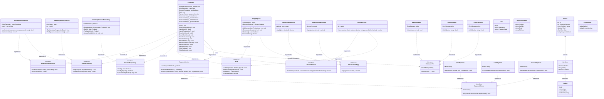

# TiendaOnline - SOLID Architecture UML Diagram

```mermaid
classDiagram
    direction TB

    %% ══════════════════════════════════════════
    %% PRESENTATION LAYER
    %% ══════════════════════════════════════════

    class ConsoleUI {
        -IAuthenticationService _authService
        -IUserRepository _userRepo
        -IProductRepository _productRepo
        -ICart _cart
        -PaymentService _paymentService
        -IInvoiceService _invoiceService
        -IValidator~string~ _nameValidator
        -IValidator~string~ _emailValidator
        -IValidator~string~ _phoneValidator
        +Run() void
        -ShowWelcomeMenu() void
        -HandleLogin() bool
        -HandleRegistration() bool
        -ShowMainMenu() void
        -ShowClientMenu() void
        -ShowProductMenu() void
        -ShowCartMenu() void
        -HandleAddToCart() void
        -HandleRemoveFromCart() void
        -HandlePayment() void
        -HandleInvoice() void
        -PrintProducts() void
        -PrintCartItems() void
    }

    %% ══════════════════════════════════════════
    %% ABSTRACTIONS (Interfaces)
    %% ══════════════════════════════════════════

    class IAuthenticationService {
        <<interface>>
        +Authenticate(user: string, pass: string) bool
        +GetCurrentUser() User?
    }

    class IUserRepository {
        <<interface>>
        +Register(data: RegistrationData) User
        +FindByUsername(name: string) User?
    }

    class IProductRepository {
        <<interface>>
        +GetAll() List~Product~
        +FindById(id: int) Product?
        +UpdateStock(id: int, qty: int) void
    }

    class ICart {
        <<interface>>
        +AddItem(product: Product, qty: int) void
        +RemoveItem(productId: int) void
        +GetItems() List~CartItem~
        +CalculateTotal() decimal
    }

    class IPaymentMethod {
        <<interface>>
        +Pay(amount: decimal, info: PaymentInfo) bool
        +Name string
    }

    class IDiscountStrategy {
        <<interface>>
        +Apply(price: decimal) decimal
    }

    class IInvoiceService {
        <<interface>>
        +Generate(cart: ICart, customerNumber: int, paymentMethod: string) Invoice
    }

    class IValidator~T~ {
        <<interface>>
        +IsValid(value: T) bool
        +ErrorMessage string
    }

    %% ══════════════════════════════════════════
    %% BUSINESS LOGIC LAYER (Services)
    %% ══════════════════════════════════════════

    class AuthenticationService {
        -IUserRepository _userRepository
        -User? _currentUser
        +Authenticate(username: string, password: string) bool
        +GetCurrentUser() User?
    }

    class InMemoryUserRepository {
        -List~User~ _users
        -int _nextId
        +Register(data: RegistrationData) User
        +FindByUsername(name: string) User?
    }

    class InMemoryProductRepository {
        -List~Product~ _products
        +Seed(products: IEnumerable~Product~) void
        +GetAll() List~Product~
        +FindById(id: int) Product?
        +UpdateStock(id: int, qty: int) void
    }

    class ShoppingCart {
        -List~CartItem~ _items
        -IDiscountStrategy? _discountStrategy
        +AddItem(product: Product, qty: int) void
        +RemoveItem(productId: int) void
        +GetItems() List~CartItem~
        +CalculateTotal() decimal
    }

    class PaymentService {
        -List~IPaymentMethod~ _methods
        +GetAvailableMethods() List~string~
        +Process(methodName: string, amount: decimal, info: PaymentInfo) bool
    }

    class CardPayment {
        +Name string
        +Pay(amount: decimal, info: PaymentInfo) bool
    }

    class CashPayment {
        +Name string
        +Pay(amount: decimal, info: PaymentInfo) bool
    }

    class AccountPayment {
        +Name string
        +Pay(amount: decimal, info: PaymentInfo) bool
    }

    class PercentageDiscount {
        -decimal _percentage
        +Apply(price: decimal) decimal
    }

    class FixedAmountDiscount {
        -decimal _amount
        +Apply(price: decimal) decimal
    }

    class InvoiceService {
        -int _nextId
        +Generate(cart: ICart, customerNumber: int, paymentMethod: string) Invoice
    }

    class NameValidator {
        +ErrorMessage string
        +IsValid(value: string) bool
    }

    class EmailValidator {
        +ErrorMessage string
        +IsValid(value: string) bool
    }

    class PhoneValidator {
        +ErrorMessage string
        +IsValid(value: string) bool
    }

    %% ══════════════════════════════════════════
    %% DOMAIN MODELS
    %% ══════════════════════════════════════════

    class User {
        +int Id
        +string Username
        +string PasswordHash
    }

    class RegistrationData {
        +string Nombre
        +string Apellido
        +string Email
        +string Telefono
    }

    class Product {
        +int Id
        +string Name
        +decimal Price
        +int StockQuantity
    }

    class CartItem {
        +Product Product
        +int Quantity
        +decimal UnitPrice
    }

    class Invoice {
        +int Id
        +int CustomerNumber
        +List~CartItem~ Items
        +decimal Total
        +DateTime Date
        +string PaymentMethod
    }

    class PaymentInfo {
        +string Method
        +string AccountNumber
    }

    %% ══════════════════════════════════════════
    %% RELATIONSHIPS
    %% ══════════════════════════════════════════

    %% Presentation depends on abstractions (DIP)
    ConsoleUI ..> IAuthenticationService : depends on
    ConsoleUI ..> IUserRepository : depends on
    ConsoleUI ..> IProductRepository : depends on
    ConsoleUI ..> ICart : depends on
    ConsoleUI ..> IInvoiceService : depends on
    ConsoleUI ..> IValidator~T~ : depends on
    ConsoleUI --> PaymentService : uses

    %% Services implement interfaces (LSP)
    AuthenticationService ..|> IAuthenticationService : implements
    InMemoryUserRepository ..|> IUserRepository : implements
    InMemoryProductRepository ..|> IProductRepository : implements
    ShoppingCart ..|> ICart : implements
    InvoiceService ..|> IInvoiceService : implements

    %% Payment strategies implement IPaymentMethod (OCP)
    CardPayment ..|> IPaymentMethod : implements
    CashPayment ..|> IPaymentMethod : implements
    AccountPayment ..|> IPaymentMethod : implements

    %% Discount strategies implement IDiscountStrategy (OCP)
    PercentageDiscount ..|> IDiscountStrategy : implements
    FixedAmountDiscount ..|> IDiscountStrategy : implements

    %% Validators implement IValidator (ISP)
    NameValidator ..|> IValidator~T~ : implements
    EmailValidator ..|> IValidator~T~ : implements
    PhoneValidator ..|> IValidator~T~ : implements

    %% Service internal dependencies (DIP)
    AuthenticationService ..> IUserRepository : depends on
    ShoppingCart ..> IDiscountStrategy : optional dependency
    PaymentService ..> IPaymentMethod : depends on
    InvoiceService ..> ICart : depends on

    %% Domain model relationships
    CartItem o-- Product : references
    Invoice *-- CartItem : contains
```
